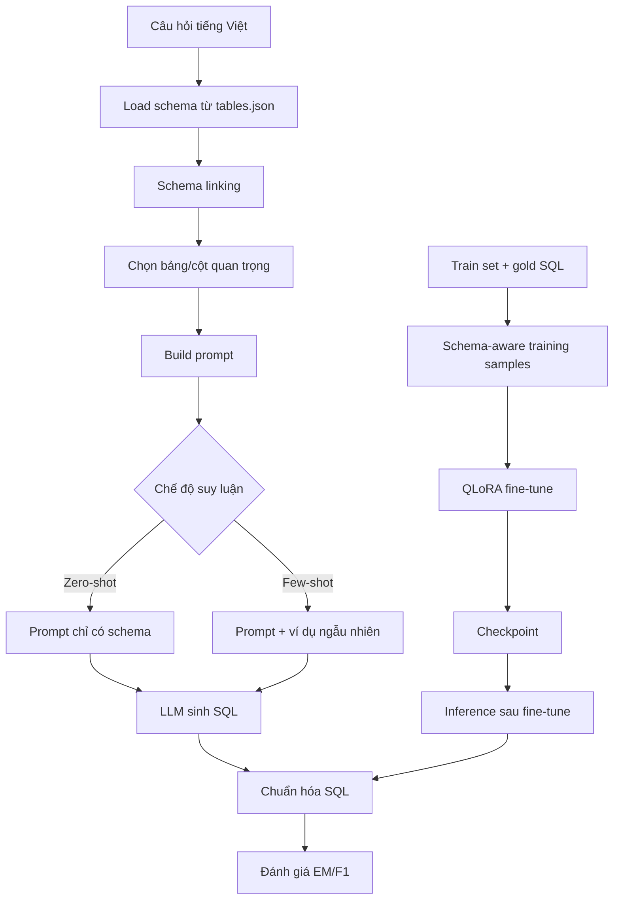

# ViText2SQL — Pipeline Text-to-SQL cho tiếng Việt

Repository Python mô-đun để thực nghiệm **Text-to-SQL** trên bộ dữ liệu [ViText2SQL](https://github.com/VinAIResearch/ViText2SQL) (VinAI Research, EMNLP 2020 Findings).

Hỗ trợ đầy đủ ba hướng tiếp cận:

| Phương pháp | Mô tả |
|-------------|--------|
| **Zero-shot** | Schema + câu hỏi, không có ví dụ |
| **Few-shot** | Thêm ví dụ ngẫu nhiên từ train set |
| **Fine-tune (QLoRA)** | Huấn luyện adapter LoRA với Unsloth trên GPU cấu hình thấp |

Đánh giá theo **Exact Match (EM)** và **Component F1** kế thừa từ [Spider Benchmark](https://github.com/taoyds/spider) — so khớp cấu trúc AST SQL, không phải so sánh chuỗi.

---

## Mục lục

- [Cấu trúc repository](#cấu-trúc-repository)
- [Yêu cầu hệ thống](#yêu-cầu-hệ-thống)
- [Cài đặt](#cài-đặt)
- [Chuẩn bị dữ liệu](#chuẩn-bị-dữ-liệu)
- [Train](#train)
- [Infer](#infer)
- [Eval](#eval)
- [Schema linking / embedding](#schema-linking--embedding)
- [Đánh giá (EM & F1)](#đánh-giá-em--f1)
- [Trích dẫn](#trích-dẫn)

---

## Kiến trúc pipeline Text-to-SQL với schema linking



### Luồng hoạt động

1. Đọc schema cơ sở dữ liệu từ `tables.json` cho từng `db_id`.
2. Chạy schema linking để giữ chỉ các bảng và cột có khả năng liên quan đến câu hỏi.
3. Tạo prompt Text-to-SQL theo format:
   - `[Schema]`
   - `[Ví dụ]` (nếu là few-shot)
   - `[Bài tập]`
   - `Câu hỏi: ...`
   - `SQL:`
4. Gửi prompt cho LLM để sinh SQL.
5. Chuẩn hóa output SQL, sau đó đánh giá bằng Exact Match (EM) và Component F1.
6. Với fine-tuning, các sample train cũng được sinh theo cùng logic schema linking để mô hình học hiệu quả hơn.

### Tại sao schema linking quan trọng?

- Giảm nhiễu khi schema lớn.
- Tăng khả năng mô hình chọn đúng bảng/cột.
- Giảm lỗi khi câu hỏi tiếng Việt không khớp trực tiếp với tên cột trong DB.
- Rất hiệu quả cho các bài toán Text-to-SQL có nhiều bảng và join phức tạp.

Trong repo này, logic schema linking đã được triển khai trong `src/utils.py` và được dùng trong cả inference lẫn fine-tune.

---

## Cấu trúc repository

```
ViText2SQL/
├── data/
│   ├── word-level/
│   │   ├── train.json
│   │   ├── dev.json
│   │   ├── test.json
│   │   ├── test_gold.sql
│   │   └── tables.json
│   ├── syllable-level/
│   └── database/
├── outputs/
├── src/
│   ├── utils.py
│   ├── inference.py
│   ├── train.py
│   ├── evaluate.py
│   └── spider_eval/
├── requirements.txt
├── README.md
├── run_pipeline.sh
└── notebooks/
```

---

## Yêu cầu hệ thống

| Thành phần | Khuyến nghị |
|------------|-------------|
| Python | 3.10+ |
| GPU (local LLM / fine-tune) | NVIDIA T4 16GB trở lên (QLoRA 4-bit) |
| RAM | ≥ 16 GB |
| API (DeepSeek/Gemini) | Không cần GPU |

---

## Cài đặt

```bash
# Clone repository
git clone <repo-url>
cd ViText2SQL

# Tạo môi trường ảo (khuyến nghị)
python -m venv .venv
source .venv/bin/activate        # Linux/macOS
# .venv\Scripts\activate         # Windows

# Cài dependencies
pip install -r requirements.txt

# NLTK (cho tokenizer Spider gốc, nếu cần)
python -c "import nltk; nltk.download('punkt')"

# Thiết lập PYTHONPATH (hoặc chạy từ thư mục gốc)
export PYTHONPATH=.               # Linux/macOS
# $env:PYTHONPATH="."            # Windows PowerShell
```

> **Lưu ý:** Package `unsloth` yêu cầu GPU NVIDIA. Nếu chỉ dùng API hoặc inference HuggingFace thuần, có thể bỏ qua lỗi unsloth hoặc cài riêng khi cần fine-tune.

---

## Chuẩn bị dữ liệu

### Hai biến thể dữ liệu

| Biến thể | Thư mục | Mô tả |
|----------|---------|--------|
| **word-level** | `data/word-level/` | Câu hỏi đã tách từ |
| **syllable-level** | `data/syllable-level/` | Bản gốc mức âm tiết |

Chọn biến thể bằng `--data_dir data/word-level` hoặc `--data_dir data/syllable-level`.

### Tập đánh giá

| Split | File | Mục đích |
|-------|------|----------|
| **test** (mặc định) | `test.json` + `test_gold.sql` | Báo cáo kết quả chính thức (theo paper) |
| **dev** | `dev.json` | Tuning / debug nhanh |

Logic tải test: câu hỏi từ `test.json`, SQL gốc ghép từ `test_gold.sql` theo đúng thứ tự dòng (chuẩn Spider).

### Database SQLite (tùy chọn)

Đặt file DB theo cấu trúc Spider:

```
data/database/{db_id}/{db_id}.sqlite
```

Cần cho **Execution Accuracy**; EM/F1 structural matching chỉ cần `tables.json`.

---

## Train

Huấn luyện QLoRA cho mô hình.

```bash
python -m src.train \
  --model qwen2.5-coder-1.5b \
  --data_dir data/word-level \
  --output_dir outputs \
  --num_epochs 3 \
  --batch_size 2 \
  --gradient_accumulation_steps 8 \
  --eval_split test
```

Các tùy chọn thường dùng:

```bash
python -m src.train \
  --model qwen2.5-coder-1.5b \
  --data_dir data/syllable-level \
  --output_dir outputs \
  --num_epochs 3 \
  --batch_size 1 \
  --gradient_accumulation_steps 8 \
  --max_samples 100
```

- Output checkpoint: `outputs/checkpoints_{model}_qlora/final/`
- Sau khi train xong, bạn có thể dùng checkpoint này cho inference tiếp theo.

### CLI bật/tắt schema linking và embedding khi train

Mặc định train đang bật schema linking, còn semantic rerank thì tắt.

```bash
# Mặc định: schema linking ON, semantic rerank OFF
python -m src.train \
  --model qwen2.5-coder-1.5b \
  --data_dir data/word-level \
  --output_dir outputs \
  --num_epochs 3 \
  --batch_size 2 \
  --gradient_accumulation_steps 8

# Tắt schema linking hoàn toàn
python -m src.train \
  --model qwen2.5-coder-1.5b \
  --data_dir data/word-level \
  --output_dir outputs \
  --num_epochs 3 \
  --batch_size 2 \
  --gradient_accumulation_steps 8 \
  --no_schema_linking

# Bật semantic rerank bằng embedding
python -m src.train \
  --model qwen2.5-coder-1.5b \
  --data_dir data/word-level \
  --output_dir outputs \
  --num_epochs 3 \
  --batch_size 2 \
  --gradient_accumulation_steps 8 \
  --use_semantic_rerank \
  --max_tables 3
```

- `--no_schema_linking`: bỏ schema linking, dùng schema đầy đủ cho toàn bộ bảng/cột
- `--use_semantic_rerank`: bật embedding rerank trong schema linking
- `--max_tables`: giới hạn số bảng giữ lại trong prompt

> Nếu dùng `--no_schema_linking`, thì `--use_semantic_rerank` không còn hiệu lực vì toàn bộ schema đã được giữ nguyên.

---

## Infer

### 1) Zero-shot

```bash
python -m src.inference \
  --model qwen2.5-coder-1.5b \
  --mode zero_shot \
  --split test \
  --data_dir data/word-level \
  --output_dir outputs
```

### 2) Few-shot

```bash
python -m src.inference \
  --model qwen2.5-coder-1.5b \
  --mode few_shot \
  --num_shots 3 \
  --split test \
  --data_dir data/word-level \
  --output_dir outputs
```

### 3) Few-shot với batch / debug

```bash
python -m src.inference \
  --model qwen2.5-coder-1.5b \
  --mode few_shot \
  --num_shots 3 \
  --split test \
  --data_dir data/word-level \
  --output_dir outputs \
  --batch_size 4 \
  --max_samples 50
```

Kết quả lưu vào: `outputs/predictions_{model}_{mode}_{split}.json`

### 4) CLI bật/tắt schema linking và embedding khi infer

Mặc định infer đang bật schema linking, còn semantic rerank thì tắt.

```bash
# Mặc định: schema linking ON, semantic rerank OFF
python -m src.inference \
  --model qwen2.5-coder-1.5b \
  --mode zero_shot \
  --split test \
  --data_dir data/word-level \
  --output_dir outputs

# Tắt schema linking
python -m src.inference \
  --model qwen2.5-coder-1.5b \
  --mode few_shot \
  --num_shots 3 \
  --split test \
  --data_dir data/word-level \
  --output_dir outputs \
  --no_schema_linking

# Bật embedding semantic rerank
python -m src.inference \
  --model qwen2.5-coder-1.5b \
  --mode zero_shot \
  --split test \
  --data_dir data/word-level \
  --output_dir outputs \
  --use_semantic_rerank \
  --max_tables 3
```

- `--no_schema_linking`: bỏ schema linking
- `--use_semantic_rerank`: bật rerank bằng embedding trong schema linking
- `--max_tables`: giới hạn top-k bảng quan trọng

> Mặc định không truyền flag là schema linking ON và semantic rerank OFF. Nếu muốn dùng embedding, hãy thêm `--use_semantic_rerank`.

---

## Eval

Sau khi có file dự đoán, chạy đánh giá EM và F1.

```bash
python -m src.evaluate \
  --predictions outputs/predictions_qwen2.5-coder-1.5b_zero_shot_test.json \
  --tables data/word-level/tables.json \
  --output_metrics outputs/metrics_zero_shot.json \
  --verbose
```

```bash
python -m src.evaluate \
  --predictions outputs/predictions_qwen2.5-coder-1.5b_few_shot_test.json \
  --tables data/word-level/tables.json \
  --output_metrics outputs/metrics_few_shot.json \
  --verbose
```

Các metric chính:
- Exact Match (EM)
- Component F1

---

## Schema linking / embedding

Trong project này, schema linking ở [`src/utils.py`](src/utils.py). Mặc định là bật.

- `use_schema_linking=True`: giữ lại các bảng/cột quan trọng, giảm nhiễu
- `use_semantic_rerank=False`: dùng lexical matching nhanh hơn
- `use_semantic_rerank=True`: dùng embedding để rerank schema theo similarity
- `max_tables=3`: chỉ giữ tối đa 3 bảng quan trọng nhất

Ví dụ cơ bản:

```python
schema_text = schema_linking(
    table_entry=table_entry,
    question=question,
    reference_sql=gold_sql,
    max_tables=3,
    use_semantic_rerank=False,
)
```

Nếu cần semantic rerank:

```python
semantic_model = get_semantic_similarity_model()

schema_text = schema_linking(
    table_entry=table_entry,
    question=question,
    reference_sql=gold_sql,
    max_tables=3,
    use_semantic_rerank=True,
    semantic_model=semantic_model,
)
```

> Gợi ý thực tế: dùng lexical matching trước; chỉ bật embedding khi muốn cải thiện câu hỏi có nghĩa tương đương nhưng chữ không khớp trực tiếp.

---

## Hướng dẫn từng module

Trong project này, schema linking được thực hiện bằng hàm `schema_linking(...)` trong [`src/utils.py`](src/utils.py), và bạn có thể bật/tắt theo nhu cầu.

#### Cấu hình mặc định

```python
USE_SCHEMA_LINKING = True
USE_SEMANTIC_RERANK = False
MAX_TABLES = 3
SEMANTIC_MODEL = None
```

#### Bật semantic rerank (embedding)

```python
from src.utils import get_semantic_similarity_model, schema_linking

SEMANTIC_MODEL = get_semantic_similarity_model()

schema_text = schema_linking(
    table_entry=table_entry,
    question=question,
    reference_sql=gold_sql,
    max_tables=MAX_TABLES,
    use_semantic_rerank=True,
    semantic_model=SEMANTIC_MODEL,
)
```

#### Tắt semantic rerank, chỉ dùng lexical matching

```python
schema_text = schema_linking(
    table_entry=table_entry,
    question=question,
    reference_sql=gold_sql,
    max_tables=MAX_TABLES,
    use_semantic_rerank=False,
)
```

#### Tắt schema linking hoàn toàn

```python
schema_text = build_full_schema_text(table_entry)
```

- `USE_SCHEMA_LINKING = True`: giữ lại schema quan trọng, giảm nhiễu cho mô hình.
- `USE_SEMANTIC_RERANK = True`: ưu tiên các bảng/cột có nghĩa gần câu hỏi, dù chữ không khớp trực tiếp.
- `MAX_TABLES = 3`: chọn tối đa 3 bảng quan trọng nhất. Bạn có thể tăng lên 4–6 nếu schema lớn nhưng cần tránh quá nhiều bảng trong prompt.
- `SEMANTIC_MODEL = None`: nếu `sentence-transformers` chưa cài hoặc không muốn dùng embedding, code sẽ tự fallback về lexical matching.

#### Dùng trong train

Trong [`src/train.py`](src/train.py), phần chuẩn bị sample huấn luyện hiện đang gọi:

```python
schema_text = schema_linking(table_entry, question, reference_sql=gold_sql)
```

Nếu muốn bật embedding ở train, hãy đổi thành:

```python
semantic_model = get_semantic_similarity_model()
schema_text = schema_linking(
    table_entry=table_entry,
    question=question,
    reference_sql=gold_sql,
    max_tables=3,
    use_semantic_rerank=True,
    semantic_model=semantic_model,
)
```

#### Dùng trong infer

Trong [`src/inference.py`](src/inference.py), phần sinh prompt theo batch đang gọi:

```python
schema_text = schema_linking(
    table_entry=table_entry,
    question=question,
    reference_sql=reference_sql,
)
```

Nếu muốn bật embedding khi suy luận, đổi thành:

```python
semantic_model = get_semantic_similarity_model()
schema_text = schema_linking(
    table_entry=table_entry,
    question=question,
    reference_sql=reference_sql,
    max_tables=3,
    use_semantic_rerank=True,
    semantic_model=semantic_model,
)
```

> Gợi ý thực tế: nếu bạn đang xử lý dataset lớn và muốn tốc độ nhanh, hãy để `use_semantic_rerank=False`. Nếu muốn tăng độ chính xác cho câu hỏi có nghĩa tương đương nhưng chữ khác, bật `use_semantic_rerank=True`.

---

### 4. Đánh giá EM & F1

> Lưu ý: `src.inference` chỉ tạo file dự đoán, không tính điểm. Để tính Exact Match và Component F1, chạy `src.evaluate`.

```bash
python -m src.evaluate \
  --predictions outputs/predictions_qwen2.5-coder-1.5b_zero_shot_test.json \
  --tables data/word-level/tables.json \
  --output_metrics outputs/metrics_zero_shot.json \
  --verbose
```

Trong đó:
- `--predictions`: file JSON do inference sinh ra.
- `--tables`: file `tables.json` của biến thể dữ liệu dùng cho schema.
- `--output_metrics`: (tuỳ chọn) lưu kết quả EM/F1 ra JSON.
- `--verbose`: in chi tiết các câu hỏi dự đoán sai.

Xuất định dạng Spider (tab-separated):

```bash
python -m src.evaluate \
  --predictions outputs/predictions_....json \
  --tables data/word-level/tables.json \
  --export_spider_format outputs/spider_format
```

Sau khi chạy, bạn sẽ nhận được EM/F1 và có thể dùng file `predict.sql` / `gold.sql` để phân tích thêm.

---

## Notebook API (DeepSeek, Gemini)

Dùng khi **không có GPU** hoặc muốn thử mô hình lớn qua API.

**File:** [`notebooks/api_zero_few_shot.ipynb`](notebooks/api_zero_few_shot.ipynb)

### Thiết lập API key

```bash
# DeepSeek — https://platform.deepseek.com/
export DEEPSEEK_API_KEY="sk-..."

# Google Gemini — https://aistudio.google.com/apikey
export GEMINI_API_KEY="..."
```

### Cấu hình trong notebook

```python
MODEL_KEY = "deepseek-coder"    # hoặc gemini-2.0-flash, gemini-1.5-pro
MODE = "few_shot"               # zero_shot | few_shot
SPLIT = "test"                  # test (mặc định) | dev
DATA_DIR = PROJECT_ROOT / "data" / "word-level"
MAX_SAMPLES = None              # None = chạy hết test set
```

Mở notebook → chạy tuần tự các cell → xem EM/F1 ở cuối.

---

## Mô hình hỗ trợ

### Local (HuggingFace + Unsloth)

| Khóa | Model ID |
|------|----------|
| `qwen2.5-coder-1.5b` | Qwen/Qwen2.5-Coder-1.5B-Instruct |
| `llama-3.2-3b` | meta-llama/Llama-3.2-3B-Instruct |
| `gemma-2-2b` | google/gemma-2-2b-it |

### API

| Khóa | Provider |
|------|----------|
| `deepseek-chat` | DeepSeek |
| `deepseek-coder` | DeepSeek (khuyến nghị cho SQL) |
| `gemini-2.0-flash` | Google Gemini |
| `gemini-1.5-pro` | Google Gemini |
| `gemini-1.5-flash` | Google Gemini |

---

## Đánh giá (EM & F1)

### Exact Match (EM)

`1` nếu cây cú pháp SQL (AST) dự đoán **khớp hoàn toàn** với gold — gồm SELECT, FROM, WHERE, GROUP BY, HAVING, ORDER BY, LIMIT, INTERSECT/UNION/EXCEPT.

### Component F1

Tính Precision / Recall / F1 **độc lập từng thành phần** (không phạt sai thứ tự cột trong SELECT hay thứ tự điều kiện AND/OR):

- SELECT (có/không aggregation)
- WHERE
- GROUP BY (+ HAVING)
- ORDER BY (+ LIMIT)

Implementation: [`src/spider_eval/evaluation_core.py`](src/spider_eval/evaluation_core.py) — kế thừa [`spider/evaluation.py`](https://github.com/taoyds/spider/blob/master/evaluation.py).

---

## Định dạng Prompt

```
Dựa vào lược đồ cơ sở dữ liệu (Database Schema) sau đây, hãy viết câu lệnh SQL chính xác cho câu hỏi tiếng Việt.

[Schema]
CREATE TABLE "..." (...);

[Ví dụ]          ← chỉ khi few-shot
Câu hỏi: ...
SQL: ...

[Bài tập]
Câu hỏi: {câu hỏi tiếng Việt}
SQL:
```

---

## Troubleshooting

| Vấn đề | Giải pháp |
|--------|-----------|
| `ModuleNotFoundError: src` | Chạy từ thư mục gốc, đặt `PYTHONPATH=.` |
| OOM khi train | Giảm `--batch_size`, tăng `--gradient_accumulation_steps` |
| Unsloth không cài được | Dùng inference không `--use_unsloth`; train cần GPU NVIDIA |
| Test số mẫu không khớp | Kiểm tra `test.json` và `test_gold.sql` cùng thứ tự, cùng biến thể (word/syllable) |
| API rate limit | Tăng `time.sleep` trong notebook; giảm `MAX_SAMPLES` |

---

## Trích dẫn

### Dataset ViText2SQL (VinAI Research)

```bibtex
@inproceedings{vitext2sql,
    title     = {{A Pilot Study of Text-to-SQL Semantic Parsing for Vietnamese}},
    author    = {Anh Tuan Nguyen and Mai Hoang Dao and Dat Quoc Nguyen},
    booktitle = {Findings of the Association for Computational Linguistics: EMNLP 2020},
    year      = {2020},
    pages     = {4079--4085}
}
```

### Spider Benchmark (metric đánh giá)

```bibtex
@inproceedings{Yu2018Spider,
    title     = {Spider: A Large-Scale Human-Labeled Dataset for Complex and Cross-Domain Semantic Parsing and Text-to-SQL Task},
    author    = {Tao Yu and Rui Zhang and Kai Yang and others},
    booktitle = {EMNLP},
    year      = {2018}
}
```

---

## Giấy phép dữ liệu

Bằng việc sử dụng ViText2SQL, bạn đồng ý:

- Chỉ dùng cho mục đích nghiên cứu hoặc giáo dục.
- **Không** phân phối ViText2SQL hoặc bất kỳ phần nào của bộ dữ liệu.
- Trích dẫn paper EMNLP 2020 Findings ở trên khi công bố kết quả.

#### Copyright (c) 2020 VinAI Research

```
THE DATA IS PROVIDED "AS IS", WITHOUT WARRANTY OF ANY KIND, EXPRESS OR
IMPLIED, INCLUDING BUT NOT LIMITED TO THE WARRANTIES OF MERCHANTABILITY,
FITNESS FOR A PARTICULAR PURPOSE AND NONINFRINGEMENT. IN NO EVENT SHALL THE
AUTHORS OR COPYRIGHT HOLDERS BE LIABLE FOR ANY CLAIM, DAMAGES OR OTHER
LIABILITY, WHETHER IN AN ACTION OF CONTRACT, TORT OR OTHERWISE, ARISING FROM,
OUT OF OR IN CONNECTION WITH THE DATA OR THE USE OR OTHER DEALINGS IN THE
DATA.
```